# Chroma-Key: Computer Vision Assignment

Introduction
============

Chroma key compositing, or chroma keying, is a visual
effects/post-production technique for compositing (layering) two images
or video streams together based on color hues (chroma range). The
technique has been used heavily in many fields to remove a background
from the subject of a photo or video -- particularly the newscasting,
motion picture, and video game industries. A color range in the
foreground footage is made transparent, allowing separately filmed
background footage or a static image to be inserted into the scene. The
chroma keying technique is commonly used in video production and
post-production. This technique is also referred to as color keying,
colour-separation overlay (CSO; primarily by the BBC), or by various
terms for specific color-related variants such as green screen, and blue
screen -- chroma keying can be done with backgrounds of any color that
are uniform and distinct, but green and blue backgrounds are more
commonly used because they differ most distinctly in hue from most human
skin colors. No part of the subject being filmed or photographed may
duplicate the color used as the backing.

![Green Screen Chroma Keying[]{label="fig:1"}](CK.jpg)

Problem 1
=========

Problem Description
-------------------

The objective of this problem was splitting a video into its constituent
frames and also to merge frames in a given folder to form a video

Solution
--------

I've read the video using openCV function VideoCapture, then extracted
each frame of the video using read function of openCV and saved these
video into the given folder. To merge videos, I've read images in the
given folder and then written it to a VideoWriter variable to form video
of given fps.

Usage
-----

### Split 

        python3 2_1.py --input v34.mp4 --algo split --dir outputdir

### Merge 

        python3 2_1.py --input v34.avi --algo merge --dir inputdir --fps 27.97

Implementation Result
---------------------

-   Implemented **split** function on a video, to split it into frames -
    [Link](https://drive.google.com/open?id=1St3s2cZObjImqMPK8Z4hOXI59y-tup_m)

-   Implemented **merge** function on images in a folder to form a
    video -
    [Link](https://drive.google.com/open?id=1Ac3b-WHlOuxvZe6ufsaqbeSmFbhPu5p4)

Learning outcome
----------------

I experimented how changing the **fps** value while merging frames to
form video can alter the way video gets rendered. Apart from that I've
learned how to use openCV for doing experiment on images and videos

Problem 2
=========

Problem description
-------------------

In this problem I've to used openCV function to capture frames using
webcam and save them into the given folder

Solution
--------

If we change the input for openCV function VideoCapture to 0, then
openCV renders frame from webcam and I've saved the frame into the
output folder using imwrite function

Usage
-----

    python3 2_2.py --dir outputdir

Implementation Result
---------------------

Implemented this code to take live video, thus render the frames to
users and save the frames into the given folder -
[Link](https://drive.google.com/open?id=1tK7lk-ilbXgRp1wRnqcbSETVTZAheArt)

Learning outcome
----------------

By doing this problem I've learnt how to use opencv to capture and save
frames using a webcam

Problem 3
=========

Problem Description
-------------------

In this problem I've used openCV to chroma key a video, i.e., given that
a video is shot in a constant colored background possibly green or blue,
we can replace the background with another video, such that the
foreground remains same and background gets replaced.

Solution
--------

I've computed the mean and deviation of the background to compute the
range within which the background pixel will exist, by taking a section
of background. After calculating the range of pixel intensity, I've
replaced the background of first video with the content of second video
wherever pixel is in this range.I apply this to every frame of the video
and merge these frame to form the resultant video. For edges I've used
an $\alpha$ value using which I decide what should be the ratio of pixel
intensity for first video and second video.

Usage
-----

    python3 2_3.py --input_1 1.mp4 --input_2 v33.mp4 --output edited.avi

Implemention Result
-------------------

Implemented Chroma-Key algorithm on two different videos and the results
can be found on following links

1.  [Link](https://drive.google.com/open?id=1ofYSM-TspZ0Xbe0uZ_9eW1glReLgUcYX)

2.  [Link](https://drive.google.com/open?id=1ReozW_mlDcKoP8DqvH-IymN3Ou42IMeS)

Learning Outcome
----------------

I've read the research paper for Blue Screen Matting[@BlueScreenMating]
and I've realised that Traingulation matting is most efficient method to
replace background but the only flaw that it has is, it needs four
images to extract the foreground from background efficiently and for
videos its two times the effort because we need to shoot the video two
times in different background. I've shot video under varying background
and lighting conditions and I've realised that chroma-key methods works
efficiently only when the first video is shot with a fixed green or blue
background and has proper lighting conditions I've tried to chroma-key
on live video shot using webcam but it didn't work efficiently because
background wasn't of fixed color. Apart from that I've also tried
applying background substraction to get the alpha matte of the first
video and then apply aplha matting to merge first and second video. But
the problem that I faced was it was blending of two videos in some
proportion and it was not a chroma key video. Finally I came to the
conclusion that only way to chroma-key a video is to have a fixed
background of green or blue color and with proper lighting conditions,
so that we can track the range of background pixel intensity and thus
replace them with that of second video to form the resultant video

Illustration of Chroma-Key on an Image
======================================

 ![Output Image[]{label="Fig:Data1"}](1.png)  ![Output Image[]{label="Fig:Data1"}](2.png) ![Output Image[]{label="Fig:Data1"}](filename.png)

Frames of Chroma-keying on a video
==================================

Video 1
-------
 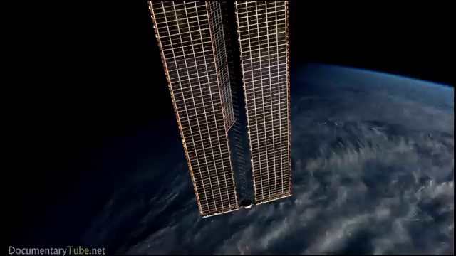  
 
   
 
 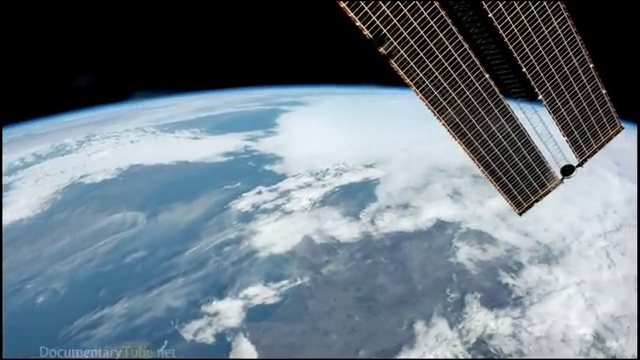  
 
 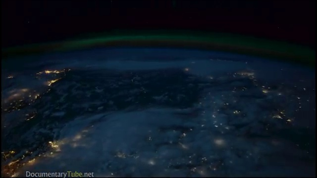  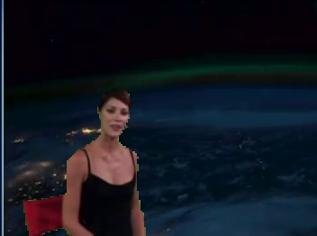
 
 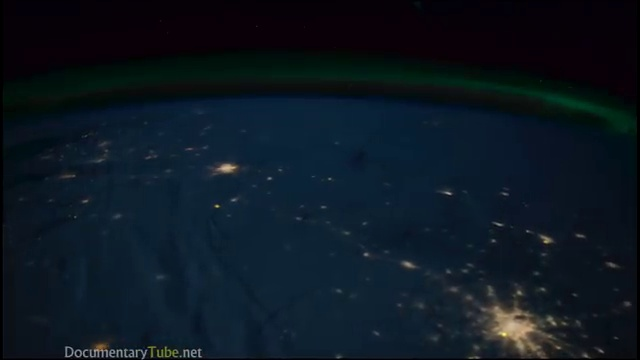  
 
 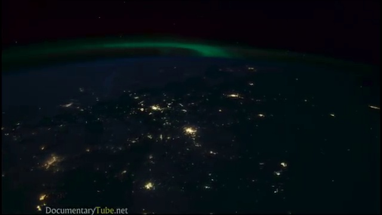  
 
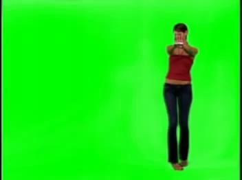 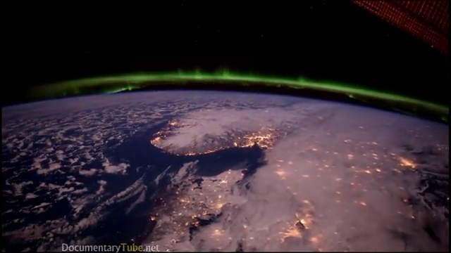  

Video 2
-------
 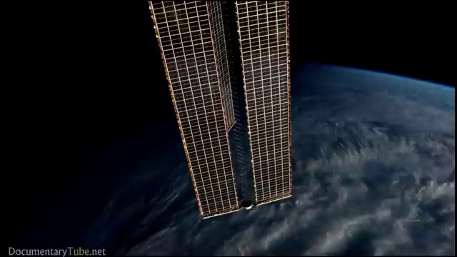 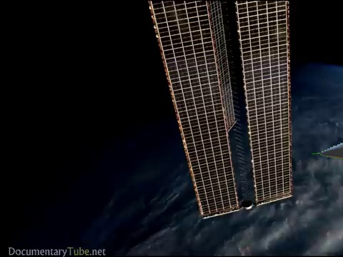
 
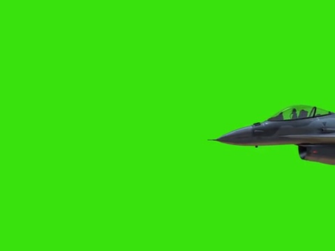 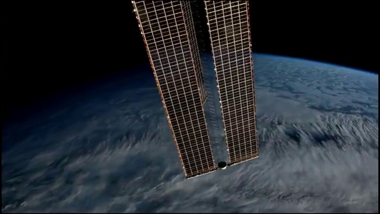  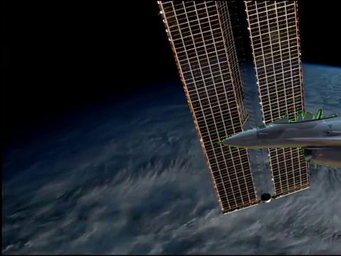
 
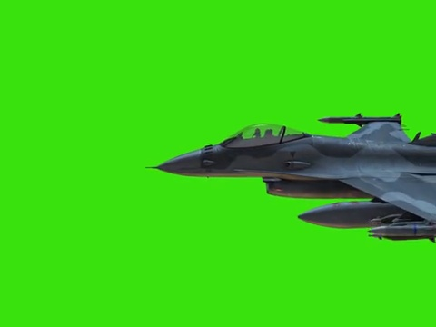 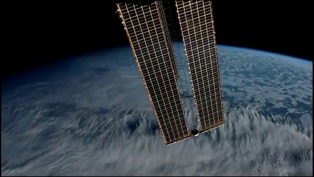  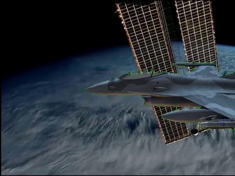
 
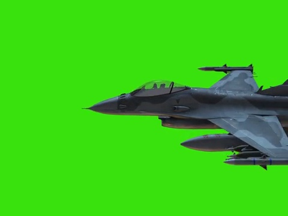 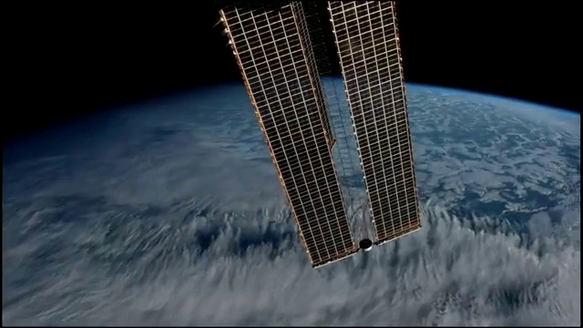  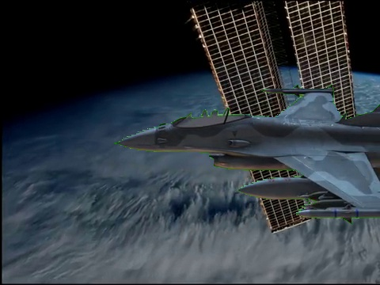

Links
=====

-   [Github Link](https://github.com/nilabja10201992/Chroma-Key)

-   [Google drive
    Link](https://drive.google.com/open?id=1K-awIH-PWCfVr32KSDbvzqSmkfcnZ0f_)

Conclusion
==========

This assignment helped me understand how to use openCV and apart from
that it was helpful in understanding how chroma-key algorithm is used in
movie industry effectively to merge two videos and render the merged
video to viewers.
